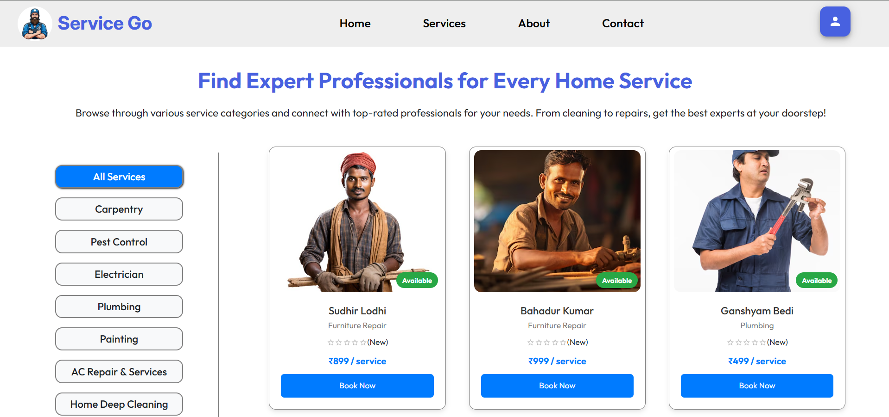
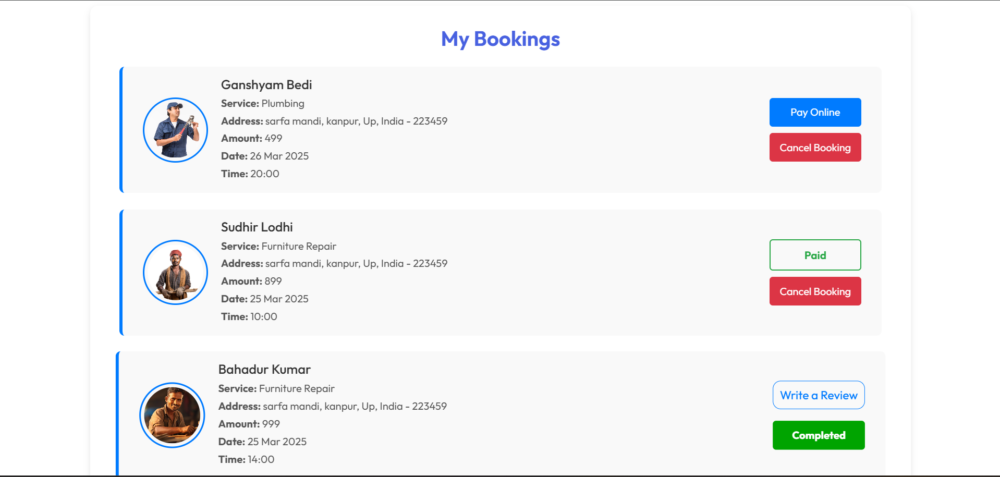

# Service Go - Your One-Stop Service Solution

Welcome to **Service Go**, the ultimate platform for connecting users with professional service providers! Whether you need a plumber, electrician, beautician, or any other service, Service Go ensures a seamless experience from booking to service completion.

---

## 🚀 About Service Go
**Service Go** is a comprehensive service marketplace where users can browse professionals, book appointments, and avail top-quality services with ease. It features a powerful admin panel, a dedicated professional dashboard, and an intuitive user experience.

## 🌟 Screenshots





### 🔥 Key Features

### **For Users** 👤
- Browse and search for professional service providers.
- View professional profiles with ratings, services, and pricing.
- Book appointments seamlessly and track status.
- Secure online payment options.
- Manage past and upcoming bookings.

### **For Professionals** 🛠️
- Dedicated dashboard to manage bookings.
- Accept, reschedule, or cancel appointments.
- Track earnings and customer reviews.
- Profile customization for better visibility.

### **For Admins** 👑
- Powerful admin dashboard to manage professionals and users.
- Monitor and approve service providers.
- Track all bookings and revenue analytics.

---

## 📂 Project Structure
```
ServiceGo/
│── frontend/       # Frontend (React + CSS + Tailwind CSS)
│── backend/        # Backend (Node.js + Express + MongoDB)
│── README.md       # Project Documentation
│── package.json    # Dependencies and Scripts
```

---

## 🛠️ Technologies Used
### **Frontend:**
- React.js
- CSS
- Tailwind CSS
- React Router DOM

### **Backend:**
- Node.js
- Express.js
- MongoDB + Mongoose
- JWT Authentication

### **Other Tools:**
- Cloudinary (for image storage)
- RazorPay (for payments)

---

## 🚀 Getting Started
### **1️⃣ Clone the Repository**
```bash
git clone https://github.com/yourusername/ServiceGo.git
cd ServiceGo
```

### **2️⃣ Backend Setup**
```bash
cd backend
npm install  # Install dependencies
node app.js  # Start backend server
```

### **3️⃣ Frontend Setup**
```bash
cd frontend
npm install  # Install dependencies
npm run dev  # Start frontend server
```

---


---

## 📌 API Routes
- **User Authentication:** `/api/auth`
- **Professionals:** `/api/professionals`
- **Bookings:** `/api/bookings`
- **Admin Controls:** `/api/admin`

---

## 📧 Contact & Support
If you have any queries or need support, feel free to reach out at **your-email@example.com**

---

## 🤝 Contributing
We welcome contributions to improve Service Go! Fork the repo and submit a PR with your enhancements.

---

## 🏆 Acknowledgments
- Special thanks to the Open Source community.
- Inspiration from platforms like UrbanClap & TaskRabbit.

---

## 📝 License
This project is licensed under the **MIT License**. Feel free to use and enhance it!

Happy Coding! 🚀


